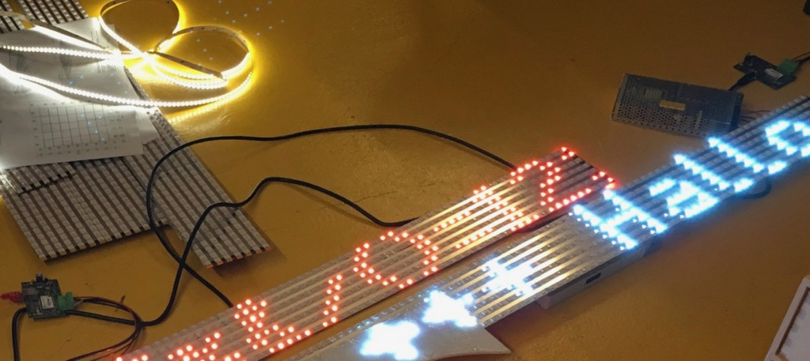
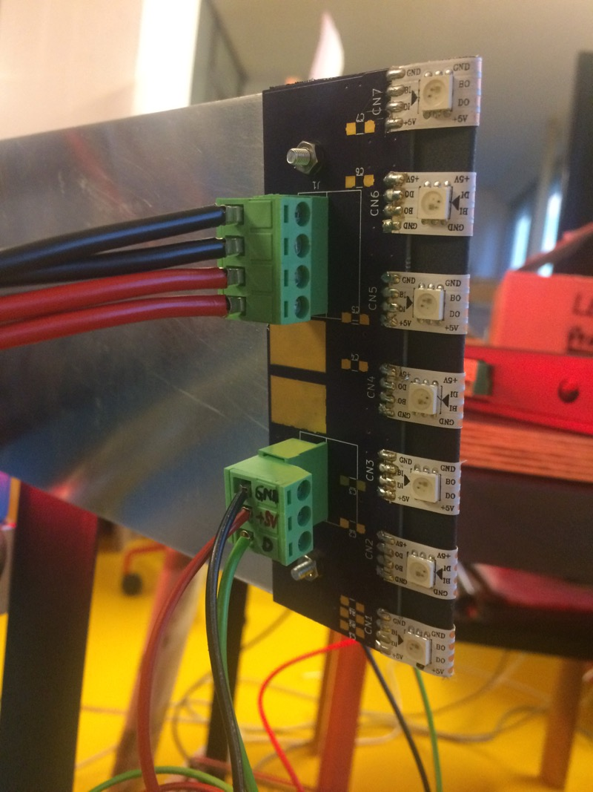

LED controller + Connector
==========================
This repository contains KiCAD schematics and layouts for two PCBs:

The **LED controller** was built to integrate:

- 5V data outputs up to 3 WS281x individually addressable LED chains
- one PWM power output for dimming up to 80W of up to 24V LED strips
- two analog inputs (0..3.3V) for external sensors
- Ethernet connectivity

The **connector board** was designed to easily connect 7 60LED/m WS2813 LED strips to form LED display modules of 7x72 pixels each. The same board can be used on both ends of the display module, it just needs to be flipped at the far end.

The controller is based on [onion.io's Omega2S](https://onion.io/omega2s) MT7688 MIPS SoC module. It is meant to run [OpenWrt](https://openwrt.org), and there is a [custom build based on OpenWrt 18.06](https://github.com/plan44/plan44-feed/tree/master/leth-config) available which includes the [p44-ledchain kernel module](https://github.com/plan44/plan44-feed/tree/master/p44-ledchain), a small webserver and a [daemon app](https://github.com/plan44/lethd) to create scrolling texts and other effects with the LED matrix.

--
First test with RGB LED matrix and single color 80W LED strip PWM dimmer:

--
[short video](docs/modules_test.m4v) showing scrolling text tests with multiple controllers and 7*72 LED matrix modules

--
LED Connector close up:

